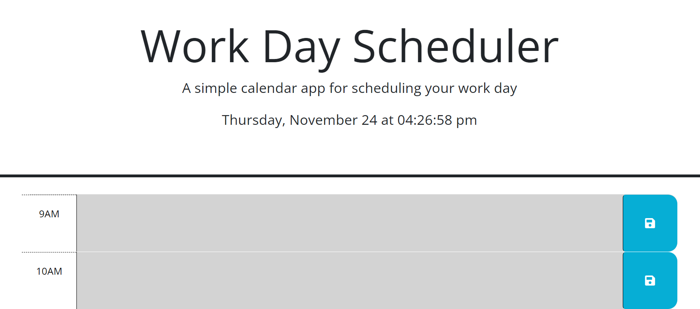
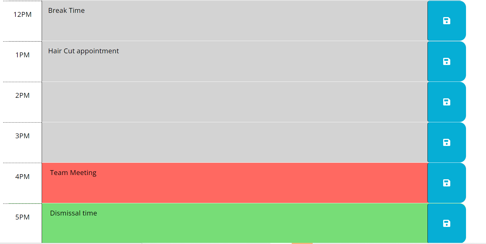

# colorfulScheduler
This Scheduler is to save and retrieve the events of  your working day

# deployed url:
 https://shaimaaghamry.github.io/colorfulScheduler/

# how to use the application

## At the begining (when the user open the scheduler web page),
1. The current date and time will be displayed

2.  The user will be presented by the time slots from (9am - 5 pm)

3. with the capability to write events in a certain time slot and save it to the local storage

4. the time slots will be displayed in colors (as shown in the above screen shot), 
        Tf  time slot is colored as gray then this event was in the past, 
        If the time slot is colored as red then this means that the event is in the present or in the current hour
        If the time slot is colored with green then the event is in the future.

# Then, If the user save an event
It will be saved in the local storage

# If the user   previously saved some events, then the page will be loaded with the saved events(loaded from the loacal storage) and then it will be displayed in its time slot and colorful (as mentioned above)

## the colors of the time slots will be changed every hour

